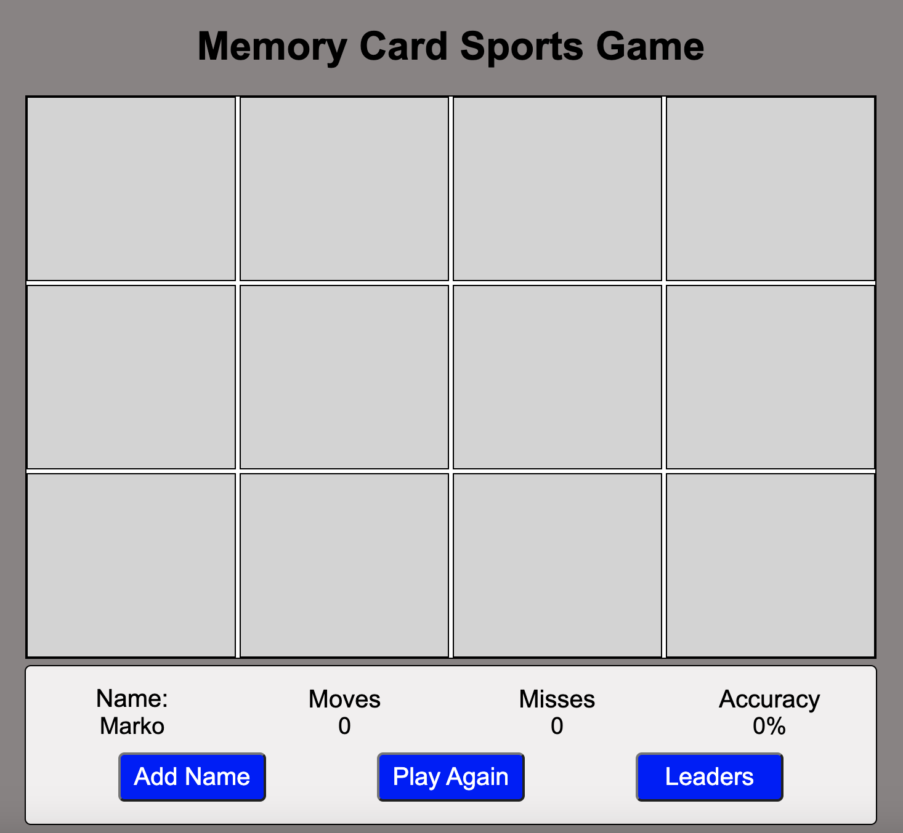
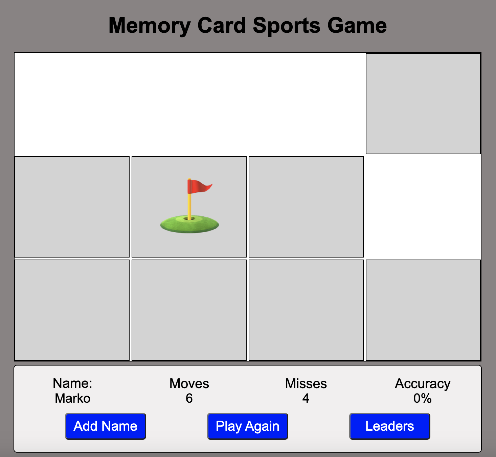
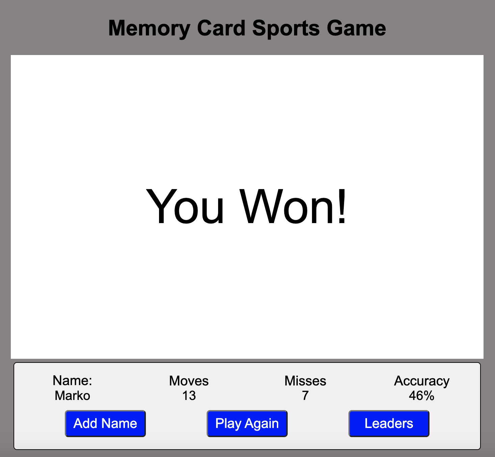

# Memory-Card-Game

-TITLE

Memory Card Game

-TECHNOLOGIES USED

HTML, CSS, JavaScript, GIT

-LINK

https://memory-card-sports-game.netlify.app

-WIREFRAMES/SCREENSHOTS

-MVP GOALS

As a player, I want to be able to turn over 2 cards. And the computer to determine whether they match or not.
As a player, I want the computer to remove cards if they match.  And to turn them facedown if they don't.
As I player, I want the computer to keep track of how many moves I made.
As a player, I want the computer to keep track of how many misses I make.
As a player, I want the computer to announce I won.  When the screen is empty and I matched all the cards.
As a player, I want the computer to let me know how accurate I was in making moves.
As a player, I want UI to look nice and be engaging.  
As a player, I want the computer to give me functionality to play again.  

-STRETCH GOALS

As a player, I'd like a lose state, meaning if I don't get the matches in a certain amount of time.  I lose the game.
As a player, I'd to see functionality to input my name.
As a player, I'd like to see a leadership board showing the highest scores.
As a player, I'd like to see storage, so it stores the leadership board upon page refresh.
As a player, I'd like to see modals to improve the UI.

-GOAL OUTCOMES

I have met all my MVP and Stretch Goals.

-TIMELINE

Friday:
Create and present proposal.  Create html, js, css files.

Saturday:
Create basic scaffolding

Sunday:
Add functionality

Monday:
Add styling

Tuesday:
Finalize MVP

Wednesday:
Work on stretch goals

Thursday:
Work on icebox items if applicable

Friday:
Presentation Day!

-ATTRIBUTIONS

The Fisher-Yates Shuffle Algorithm was utilized in the shuffle array.

-NEXT STEPS

Add media queries, to enable responsiveness.

